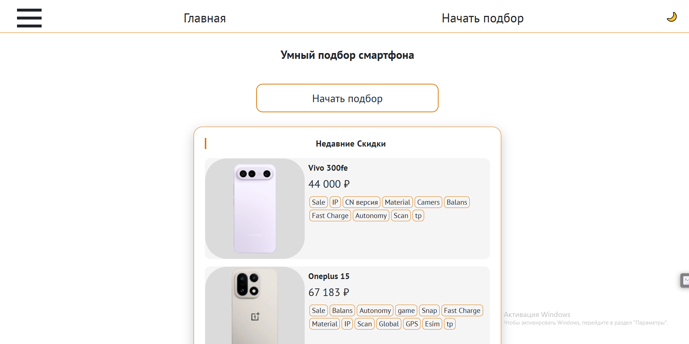
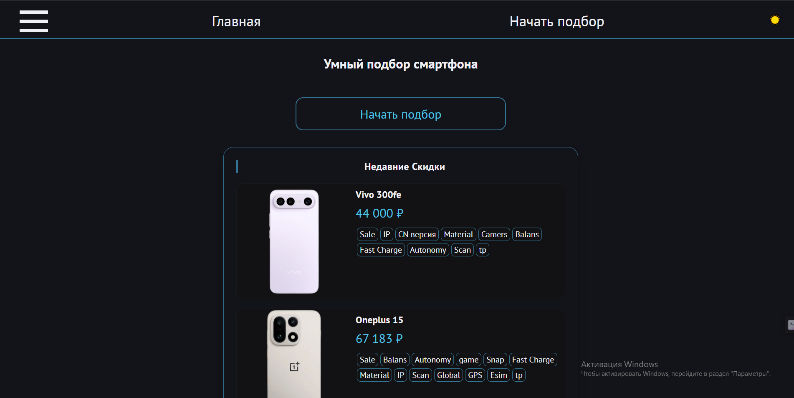
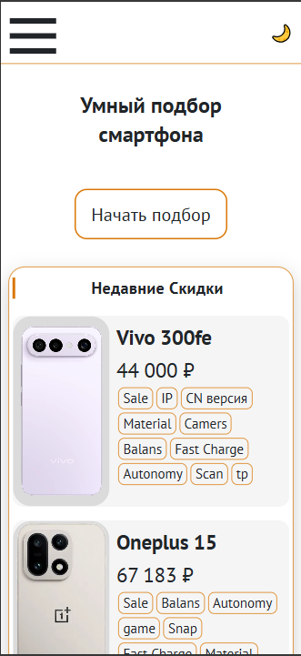
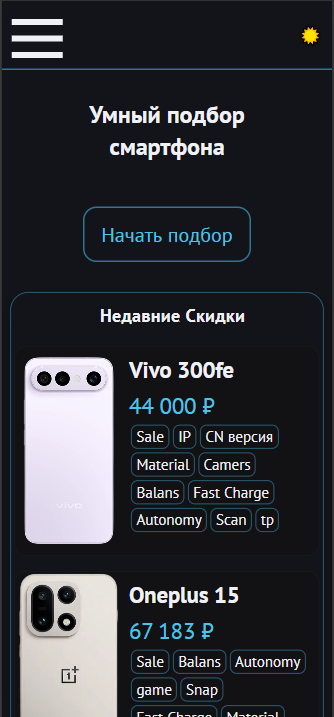
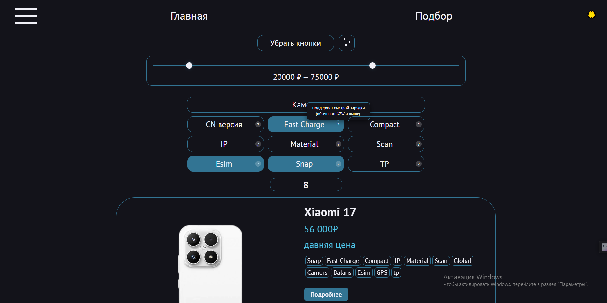
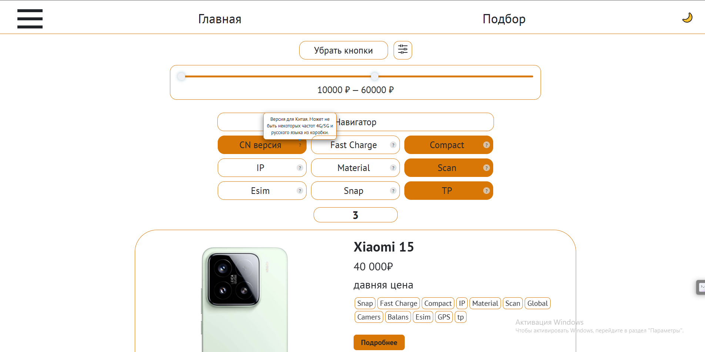
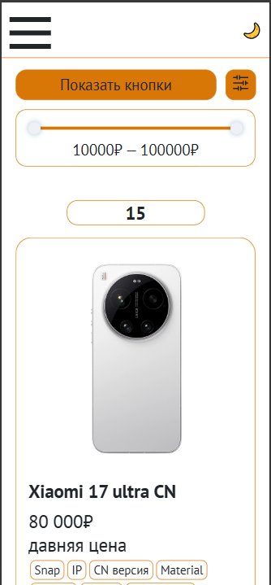
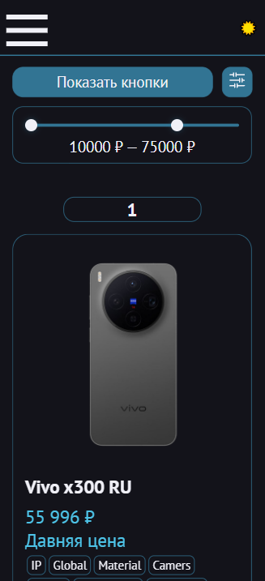

<<<<<<< HEAD
# smart_phone_selection
Интерактивный каталог современных смартфонов с динамической фильтрацией и адаптивным интерфейсом. Проект создан для демонстрации навыков работы с манипуляцией DOM, фильтрацией массивов данных и LocalStorage.
 Основные возможности
Динамический фильтр: Поиск смартфонов по тегам (Global, Snapdragon, Compact и др.) без перезагрузки страницы.
Фильтрация по цене: Интерактивный ползунок (range input) для выбора бюджета.
Категории: Сортировка через выпадающий список (Select) по ключевым характеристикам.
Сохранение состояния: Благодаря LocalStorage, выбранные пользователем фильтры и настройки цены сохраняются после обновления страницы.
Адаптивное меню: Кастомное бургер-меню для мобильных устройств.
Переключение тем: Возможность менять визуальное оформление шапки сайта.
 Технологии
HTML5 (семантическая верстка, дата-атрибуты)
CSS3 (Flexbox, анимации превращения бургера в крестик, адаптивность)
JavaScript (ES6+):
Модульная структура данных (export/import).
Методы массивов (filter, every, splice, includes).
Делегирование событий и работа с JSON.
 Структура данных
Данные о телефонах хранятся в формате объектов:
javascript
{
    id: 1,
    name: "OnePlus 13 CN",
    tags: ["balans", "snap", "fastcharge"],
    desc: "Прекрасный баланс, супер ОС...",
    img: "img/OnePlus13.jpg",
    price: "40 000₽",
    link: "https://..."
}

=======
# smart_phone_selection
Интерактивный каталог современных смартфонов с динамической фильтрацией и адаптивным интерфейсом. Проект создан для демонстрации навыков работы с манипуляцией DOM, фильтрацией массивов данных и LocalStorage.
 Основные возможности
Динамический фильтр: Поиск смартфонов по тегам (Global, Snapdragon, Compact и др.) без перезагрузки страницы.
Фильтрация по цене: Интерактивный ползунок (range input) для выбора бюджета.
Категории: Сортировка через выпадающий список (Select) по ключевым характеристикам.
Сохранение состояния: Благодаря LocalStorage, выбранные пользователем фильтры и настройки цены сохраняются после обновления страницы.
Адаптивное меню: Кастомное бургер-меню для мобильных устройств.
Переключение тем: Возможность менять визуальное оформление шапки сайта.
 Технологии
HTML5 (семантическая верстка, дата-атрибуты)
CSS3 (Flexbox, анимации превращения бургера в крестик, адаптивность)
JavaScript (ES6+):
Модульная структура данных (export/import).
Методы массивов (filter, every, splice, includes).
Делегирование событий и работа с JSON.
 Структура данных
Данные о телефонах хранятся в формате объектов:
javascript
{
    id: 1,
    name: "OnePlus 13 CN",
    tags: ["balans", "snap", "fastcharge"],
    desc: "Прекрасный баланс, супер ОС...",
    img: "img/OnePlus13.jpg",
    price: "40 000₽",
    link: "https://..."
}

>>>>>>> 8bdff98c03747c2200660e0cc693517b477d32f7
